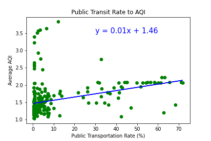
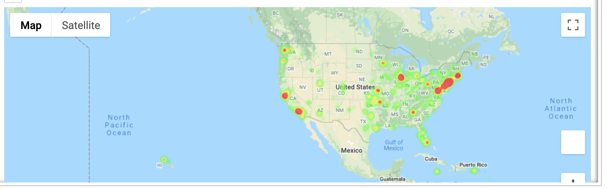

# Project_01

## Team Members:
* Chris Pulliam
* Briana Staples
* Patrice Woida
* Katie Hartmann

## Project Description/Outline:
Looking at air quality and its relationship to population density and access to public transportation and weather patterns.  

## Possible Questions to Answer: 
- Is there a direct relationship between population density and air quality?

- How does use of Public Transportation play a part in air quality, does higher usage of Public Transportation equate to better air quality?

- Do areas with a smaller population but also less access to Public Transportation have comparible air quality to an area with a higher population?

- How do weather patterns play a part?

- Do hotter dryer areas have a worse air quality despite their population and access to public transportation?

- Do colder and wetter areas have better air quality despite their population and access to public transportation?

## Next steps
Research the air quality data set and combing with citipy to get a list of cities that we want to focus on. What kind of data do we have to work with?  
- 2/1 Next Steps: Chris to pull the dataset from the API to know the data we will be working with to help us determine our specific questions to answer. 
- 2/5 : Met with the team to determine a better direction of questions and a hypothesis to determine.  Found better data sets to work with and determined that population/air quality/transportation and weather patterns all can be tracked and could have a direct effect on each other.
- 2/6 : narrowing down the cities to focus on and looking for patterns

## Major Findings:
### Does high use of public transportation increase the quality of air?
- There is a connection between public transportation and air quality, however it's not as strong as we were expecting.

### Do cities with a higher population have worse AQI than smaller cities despite the use of public transportation?
- California has the worst air quality overall, no matter the population of the area or the percentage of people using public transportation.

### Comparison of the population of the city compared to air quality
- Population of the city does not seem to impact air quality.

### Where is the best public transit usage?
- The east coast has a higher usage of public transportation than the rest of the country.

